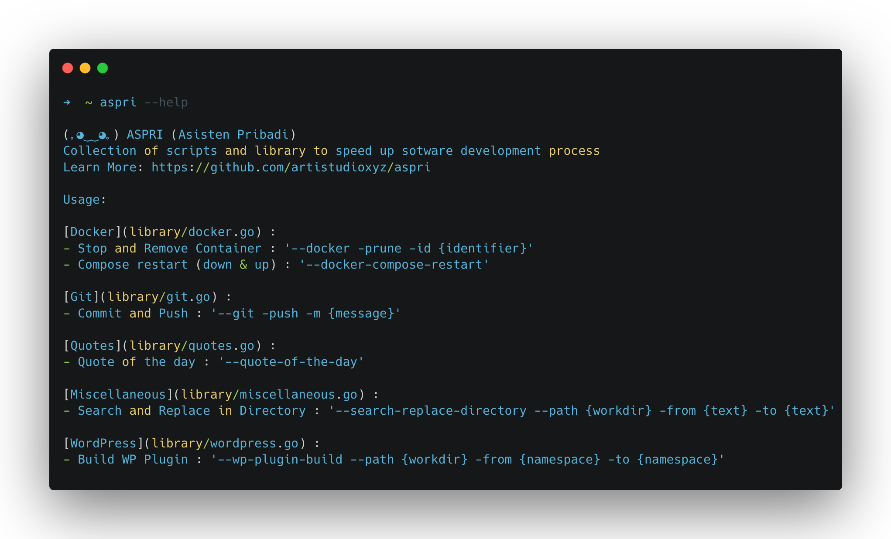

    
    
    
    
    
    

# ASPRI (Asisten Pribadi)

💃 a Collection of scripts and libraries to speed up sotware development process

## 📝 Installation

You can install aspri by using one of these method

### Install from binary

- Download the latest binary from [release branch](https://github.com/artistudioxyz/aspri/tree/release/dist)
- Extract the binary to your `$PATH` directory
- Make sure the binary is executable

### Install using `go get`

- Run : `go get github.com/artistudioxyz/aspri`

### Install from source

- Re-initiate go.mod : `rm go.mod && go mod init aspri`
- Go Install : `go install`
  - to Generate binary for other OS : `./build.sh`

### Note

- Please add your go install to system PATH [Learn More](https://go.dev/doc/tutorial/compile-install)

## 📟 Commands

[ChatGPT](library/chatgpt.go) :

- Start Chat : `--chatgpt --api-key {API_KEY}`
  - The chat support multiple line, don't forget to end it with `~` to get an answer.
  - Get the api key from [here](https://beta.openai.com/account/api-keys)

[Docker](library/docker.go) :

- Stop and Remove Container : `--docker --prune -id {identifier}`
- Compose restart (down & up) : `--docker-compose-restart -f {filename}`

[Git](library/git.go) :

- Commit and Push : `--git -m {message}`
	- Reset Cache : `--git-reset-cache`

[Markdown](library/markdown.go) :

- Remove Link from Markdown File : `--md --remove-link --path {workdir}`

[NoIP](library/noip.go) :

- Update Hostname : `--noip --update -u {username} -p {password} --hostname {hostname}`

[PHP](library/php.go) :

- Lists all class in directory nested : `--php --list-class --path {workdir}`
- Lists all function in directory nested : `--php --list-function --path {workdir}`
- **Support Multiple Params**
	- FunctionName : `--functionname {FunctionName}`

[Miscellaneous](library/miscellaneous.go) :

- Remove Directories or Files Nested by Filenames :
	- Remove Directories `--dir --remove --dirname {filename} --path {workdir}`
	- Remove Files `--file --remove --f {filename} --path {workdir}`
- Remove Files Nested Except Extensions : `--file --remove --ext {.php} --except {composer.json} --path {workdir}`
- Search and Replace in Directory or File : `--search-replace --path {dir or file} --from {text} --to {text}`
- **Support Multiple Params**
  - Dirname : `--dirname {dirname}`
  - Filename : `-f {filename}`
  - Except : `--except {except}`
  - Extension : `--ext {ext}`

[Quotes](library/quotes.go) :

- Quote of the day : `--quote-of-the-day`

[WordPress](wordpress/wordpress.go) :

- Refactor Dot Framework : `--wp-refactor --path {workdir} --from {namespace} --to {namespace} --type {plugin|theme}`
- WP Clean Project Files for Production : `--wp-clean --path {workdir} --type {wordpress|github}`
- WP Plugin Build Check : `--wp-plugin-build-check --path {workdir}`
	- Build WP Plugin (Require Path) : `--wp-plugin-build --path {workdir} --type {wordpress|github}`
- WP Theme Build Check : `--wp-theme-build-check --path {workdir}`
	- Build WP Plugin (Require Path) : `--wp-theme-build --path {workdir} --type {wordpress|github}`

## ⚒️ Built with

- [Commitlint](https://commitlint.js.org)
- [Golang pflag](https://pkg.go.dev/github.com/spf13/pflag)
- [Husky](https://typicode.github.io/husky)
- [Release-It](https://www.npmjs.com/package/release-it)
	- [Conventional Changelog](https://github.com/release-it/conventional-changelog)
