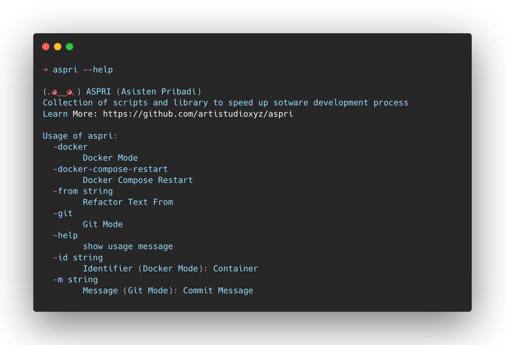

# ASPRI (Asisten Pribadi)

a Collection of scripts and libraries to speed up sotware development process

## 📝 Installation
- Run : `go install`
- Run : `aspri --version`

Note :
- Please add your go install to system PATH [Learn More](https://go.dev/doc/tutorial/compile-install)

## 📟 Commands
[Docker](library/docker.go) :
- Stop and Remove Container : `--docker-snr -id {identifier}` 
- Compose restart (down & up) : `--docker-compose-restart`

[Git](library/git.go) :
- Commit and Push : `--git-cnp -m {message}`

[Quotes](library/quotes.go) :
- Quote of the day : `--quote-of-the-day`

[Miscellaneous](library/miscellaneous.go) :
- Search and Replace in Directory : `--search-replace-directory --path {workdir} -from {text} -to {text}`

[WordPress](library/wordpress.go) :
- Build WP Plugin : `--wp-plugin-build --path {workdir} -from {namespace} -to {namespace}`